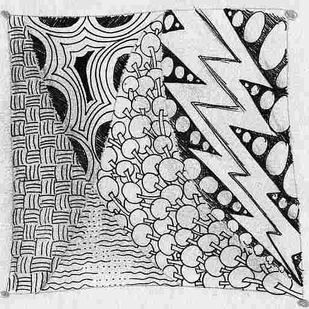

[You are now in GitHub source code view - click this link to view Read Me file as a web page]
( https://cynthiaarmour.github.io/index.html#readme.md "View file as a web page." ) 
<input type=button onclick=window.location.href='https://github.com/cynthiaarmour/cynthiaarmour.github.io/'; value='You are now in GitHub web page view - Click this button to view Read Me file as source code' >

[Cynthia Armour Read Me]( index.html )
===

I live in Oakland, California. 

I ride a bike, take the train, and drive someone else's car. 

I am an advocate for active transportation networks. 
There is no silver bullet to the transportation question. 
Rather, what we need is a portfolio of options, each additional one increasing our mobility. 
An active network offers a variety of ways to get from A to B, all efficient in their own sense.  

* [cynthiaarmour.com]( http://www.cynthiaarmour.com/ )
* [Bike East Bay]( https://bikeeastbay.org/staff )

## [Oakland Gran Fondo 2016 3D Viewer R11]( https://cynthiaarmour.github.io/oakland-gran-fondo-2016/r11/ )

### [Oakland Gran Fondo 2016 3D Viewer R11 Read Me]( https://cynthiaarmour.github.io/oakland-gran-fondo-2016/#readme.md )

## [Oakland Gran Fondo 2016 3D Viewer R10]( https://cynthiaarmour.github.io/oakland-gran-fondo-2016 )